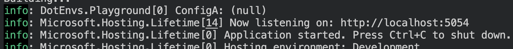
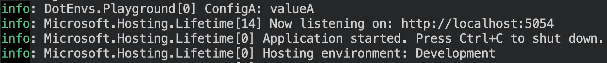

## .env in .NET

> Connecting the Dots

Sometimes, a development team may want to have a configuration variable individual for every developer. There's no better tool to achieve that than `.env` files. However, .NET applications do not include this configuration source by default. Gladly, that's easy to fix. Let's do just that!

## Preparing the Playground

```sh
dotnet new web --name DotEnvs.Playground
```

```csharp
var builder = WebApplication.CreateBuilder(args);

builder.Logging.AddSimpleConsole(c => c.SingleLine = true);

var app = builder.Build();

app.Logger.LogInformation("ConfigA: {ConfigA}", app.Configuration["ConfigA"]);

app.Run();
```

`.env`

```sh
ConfigA=valueA
```

`cd DotEnvs.Playground` `dotnet run`



## Loading the Variables

```csharp
using dotenv.net;

DotEnv.Load();

// Rest of the Program: 
// var builder = WebApplication.CreateBuilder(args); ...
```



## Fixing Publishing

```sh
dotnet publish && cd bin/Release/net9.0/publish && dotnet DotEnvs.Playground.dll && cd ../../../..
```


`<Content Include=".env" CopyToPublishDirectory="Always"/>`

> It's typically advised to create another `ItemGroup` for nesting `Content`, but I find that quite redundant and prefer keeping my project file concise over making it. But feel free to pick your poison 🙂

```xml
<Project Sdk="Microsoft.NET.Sdk.Web">

  <PropertyGroup>
    <TargetFramework>net9.0</TargetFramework>
    <Nullable>enable</Nullable>
    <ImplicitUsings>enable</ImplicitUsings>
  </PropertyGroup>

  <ItemGroup>
    <PackageReference Include="dotenv.net" Version="3.2.1" />    
    <Content Include=".env" CopyToPublishDirectory="Always"/>
  </ItemGroup>
</Project>
```

> Unlike `CopyToOutputDirectory` `CopyToPublishDirectory` does **not** make the file required.

```sh
dotnet publish && cd bin/Release/net9.0/publish && dotnet DotEnvs.Playground.dll && cd ../../../..
```


## TLDR;

`.env` files are one of the most fundamental sources of configuration. .NET doesn't include it by default, sill using the `dotenv.net` nuget package we can easily add the source to our app. Just make sure not to forget:

1. Load environment variables from the file:

```csharp
using dotenv.net;

DotEnv.Load();
``` 

2. Include the file in the publish directory. (in case it's not only used for local debugging)

```xml
<Content Include=".env" CopyToPublishDirectory="Always"/>
```

3. Add `.env` to `.gitignore`.

Since the main use-case of this file is to be developer-specific.

4. Clap for this article 👏

Well, that's not required... but would be appreciated 👉👈
