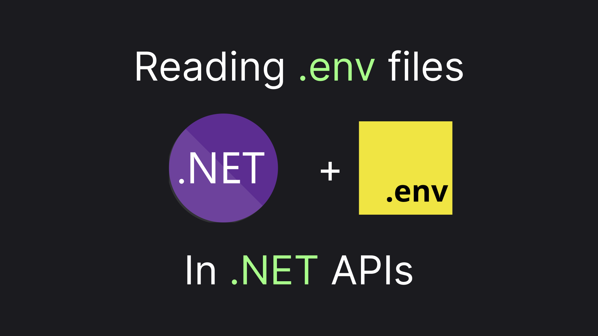

## .env in .NET

> Connecting the Dots

Sometimes, a development team may want to have a configuration variable individual for every developer. There's no better tool to achieve that than `.env` files. However, .NET applications do not include this configuration source by default. Gladly, that's easy to fix. Let's do just that!



## Preparing the Playground

> You can jump straight to the [TLDR](#tldr) in the end if you don't need a complete guide

We'll use a minimalistic web application template to get started. Here's the script that lets us start with the app:

```sh
dotnet new web --name DotEnvs.Playground
```

To be able to check the configuration state we'll log our configuration value right before running the application. We'll also adjust our logging for using a single line, just to make the logs look less messy. Here's how our `Program.cs` should look after the adjustments:

```csharp
var builder = WebApplication.CreateBuilder(args);

builder.Logging.AddSimpleConsole(c => c.SingleLine = true);

var app = builder.Build();

app.Logger.LogInformation("ConfigA: {ConfigA}", app.Configuration["ConfigA"]);

app.Run();
```

And finally, let's place the `.env` file with our configuration in our project folder. Here's how the file content should look:

```sh
ConfigA=valueA
```

Now by starting our project using `dotnet run` we should see logs similar to the one below:

> The article assumes all scripts are run from the project folder, so don't forget to `cd DotEnvs.Playground` before running the scripts.


As we might expect, our `.env` file is not read yet, so we get a null for our configuration value. Let's get to the interesting part and fix it!

## Loading the Variables

We'll use a nuget package called `dotenv.net`. You can install it like this:

```sh
dotnet add package dotenv.net
```

Now, all we have to do is load variables from the `.env` files as environment variables **before** configuring our application. Here's the code:

```csharp
using dotenv.net;

DotEnv.Load();

// Rest of the Program: 
// var builder = WebApplication.CreateBuilder(args); ...
```

Since the default web app configuration already loads environment variables as a configuration source the variables loaded from the env files will be loaded as well. So `dotnet run`ning our application will print our configuration value to the console:


So far so good! We were able to load configuration values from the `.env` files. But we have just one more thing to cover.

> ⚠️ Before the last thing, there's one more important thing. 🙂 
> The `.env` file typically contains something developer-specific. Moreover, it frequently contains something confidential, so it's almost always should be added to the `.gitignore`

## Fixing Publishing

We were able to get our `.env` run with a `dotnet run`. But let's try to run this thing as we would do when publishing. Here's the script:

> The script assumes the project uses .NET 9 and is named `DotEnvs.Playground`

```sh
dotnet publish && cd bin/Release/net9.0/publish && dotnet DotEnvs.Playground.dll && cd ../../../..
```

Here's the result we'll get:


We'll get `null` for our configuration value because our content folder changed and our `.env` file is just not there. To make the files included in the publish folder we have to add `<Content Include=".env" CopyToPublishDirectory="Always"/>` to an `ItemGroup` in our `csproj`. Here's how the file can look like after the addition:

> It's typically advised to create another `ItemGroup` for nesting `Content`, but I find that quite redundant and prefer keeping my project file concise over making it. But feel free to pick your poison 🙂

```xml
<Project Sdk="Microsoft.NET.Sdk.Web">

  <PropertyGroup>
    <TargetFramework>net9.0</TargetFramework>
    <Nullable>enable</Nullable>
    <ImplicitUsings>enable</ImplicitUsings>
  </PropertyGroup>

  <ItemGroup>
    <PackageReference Include="dotenv.net" Version="3.2.1" />    
    <Content Include=".env" CopyToPublishDirectory="Always"/>
  </ItemGroup>
</Project>
```

> Unlike `CopyToOutputDirectory` `CopyToPublishDirectory` does **not** make the file required. Although the former is advised way more frequently I find the former way more useful - for example in the context of a docker build, which uses publishing under the hood.

With that setup if we simulate running a published app again

```sh
dotnet publish && cd bin/Release/net9.0/publish && dotnet DotEnvs.Playground.dll && cd ../../../..
```

We'll get our variable back, with logs looking something like that:


This completes our small journey. Let's recap it with a little instruction in the TLDR; section.

## TLDR;

`.env` files are one of the most fundamental sources of configuration. .NET doesn't include it by default, sill using the `dotenv.net` nuget package we can easily add the source to our app. Just make sure not to forget:

1. Load environment variables from the file:

```csharp
using dotenv.net;

DotEnv.Load();
``` 

2. Include the file in the publish directory. (in case it's not only used for local debugging)

```xml
<Content Include=".env" CopyToPublishDirectory="Always"/>
```

3. Add `.env` to `.gitignore`.

Since the main use-case of this file is to be developer-specific.

4. Clap for this article 👏

Well, that's not required... but would be appreciated 👉👈
