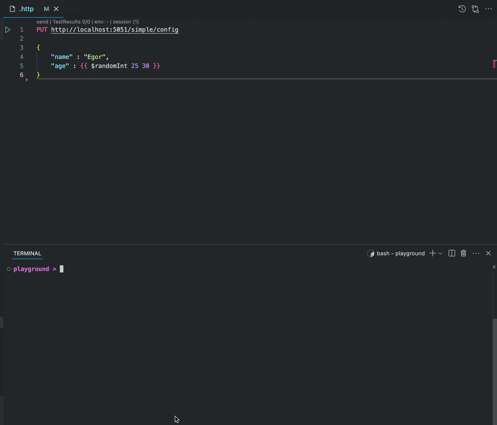

# MongoDB as .NET Configuration Provider

> Building Custom Configuration Provider to Read Configuration from MongoDB in an ASP .NET Core App.

An ASP .NET Core app comes with multiple built-in Configuration Sources such as `appsettings.json`, environment variables, and command-line arguments. Unfortunately, neither of them provides a convenient way to update a configuration value on the fly. Things get especially complex with distributed systems where we need to update the settings just once and get them propagated to multiple application instances.

We need a database! MongoDB is JSON-based, so it comes with a dynamic schema and resemblance to appsettings.json - let's use it. All that's left to do is to build our MongoDB Configuration Provider.

## Building the Foundation: Mapping BsonDocument to Configuration

First thing we'll need to do is to create our database model and find a way to fill the configuration from it. We'll install `Persic.Mongo` package, which includes `Mongo.Driver`, but comes with a few helpful extensions on top:

```sh
dotnet add package Persic.Mongo
```

To map `BsonDocument` to configuration `Dictionary` we'll need to:

a. Map primitive data structures  
c. Map inner documents using the name of the property and `:`  
b. Map arrays by appending array property name, `:`, index, and `:` once again  

Here's the code we can end up with:

> `IMongoRecord<string>` is an interface from `Persic.Mongo`, implementing it will come in handy later

```csharp
public record ConfigurationRecord(string Id, BsonDocument Value) : IMongoRecord<string>
{
    public Dictionary<string, object> ToConfigurationDictionary()
    {
        var configs = new Dictionary<string, object>();
        EnrichFromBsonDocument(configs, Value);
        return configs;
    }

    private static void EnrichFromBsonDocument(
        Dictionary<string, object> configs, 
        BsonDocument document, 
        string prefix = ""
    )
    {
        foreach (var pair in document)
        {
            if (pair.Value.IsBsonDocument)
            {
                EnrichFromBsonDocument(configs, pair.Value.AsBsonDocument, prefix + pair.Name + ":");
            }
            else if (pair.Value.IsBsonArray)
            {
                var array = pair.Value.AsBsonArray;
                for (var i = 0; i < array.Count; i++)
                {
                    EnrichFromBsonDocument(configs, array[i].AsBsonDocument, prefix + pair.Name + ":" + i + ":");
                }
            }
            else
            {
                configs[prefix + pair.Name] = pair.Value.ToJson();
            }
        }
    }
}
```

Now, when we can translate the mongo record to the configuration data, let's figure out how to upload the data to Microsoft's configuration system.

## Strengthening the Foundation: Loading Mongo Documents to Configuration Stores

In [this article](https://medium.com/@vosarat1995/configuration-provider-in-net-based-on-background-service-b4d8aa1713ad) we've investigated how to connect a background service to the .NET configuration system. Long story short, we need to use singleton-resembling `ConfigurationBackgroundStore`s. We can add them using the `Confi.BackgroundStore` package:

```sh
dotnet add package Confi.BackgroundStore
```

We'll need to create a store per configuration source we want to use, so we'll use the `id` of the document we want to read configuration from as a key. We'll use `SetAll` method of the store to upload the data from a `ConfigurationRecord` using the mapping we've implemented earlier. Let's call our class `Loader` and sketch an initial implementation:

```csharp
public class MongoConfigurationLoader( 
    ConfigurationBackgroundStore.Factory factory,
    string documentId
)
{
    private const string keyPrefix = "mongo";
    public static string Key(string documentId) => $"{keyPrefix}:{documentId}";

    private readonly ConfigurationBackgroundStore store = factory.GetStore(Key(documentId));

    public void Upload(ConfigurationRecord configurationRecord)
    {
        store.SetAll(configurationRecord.ToConfigurationDictionary());
    }
}
```

Our loader should provide us with everything we need to implement a background service for reading configuration from mongo. Let's inject `ILogger<MongoConfigurationLoader>`, `IMongoCollection<ConfigurationRecord>` and implement a couple of helper methods:

```csharp
public IMongoCollection<ConfigurationRecord> Collection { get; } = collection;
public string DocumentId { get; } = documentId;
public ILogger<MongoConfigurationLoader> Logger { get; } = logger;

public string CollectionName => Collection.CollectionNamespace.CollectionName;

public async Task<ConfigurationRecord?> SearchAsync(CancellationToken cancellationToken)
{
    return await Collection.Find(x => x.Id == DocumentId)
        .FirstOrDefaultAsync(cancellationToken: cancellationToken);
}
```

Finally, to simplify creation of the loader for various `documentId`s let's create a little factory:

```csharp
public class Factory(
    IMongoCollection<ConfigurationRecord> collection,
    ConfigurationBackgroundStore.Factory configurationFactory,
    ILogger<MongoConfigurationLoader> logger
)
{
    public MongoConfigurationLoader GetLoader(string documentId)
    {
        return new MongoConfigurationLoader(collection, configurationFactory, documentId, logger);
    }
}
```

Putting it all together, here's how our code might look like:

```csharp
public class MongoConfigurationLoader(
    IMongoCollection<ConfigurationRecord> collection, 
    ConfigurationBackgroundStore.Factory factory,
    string documentId,
    ILogger<MongoConfigurationLoader> logger
)
{
    private const string keyPrefix = "mongo";
    public static string Key(string documentId) => $"{keyPrefix}:{documentId}";

    private readonly ConfigurationBackgroundStore store = factory.GetStore(Key(documentId));

    public void Upload(ConfigurationRecord configurationRecord)
    {
        store.SetAll(configurationRecord.ToConfigurationDictionary());
    }
    
    public IMongoCollection<ConfigurationRecord> Collection { get; } = collection;
    public string DocumentId { get; } = documentId;
    public ILogger<MongoConfigurationLoader> Logger { get; } = logger;

    public string CollectionName => Collection.CollectionNamespace.CollectionName;

    public async Task<ConfigurationRecord?> SearchAsync(CancellationToken cancellationToken)
    {
        return await Collection.Find(x => x.Id == DocumentId).FirstOrDefaultAsync(cancellationToken: cancellationToken);
    }

    public class Factory(
        IMongoCollection<ConfigurationRecord> collection,
        ConfigurationBackgroundStore.Factory configurationFactory,
        ILogger<MongoConfigurationLoader> logger
    )
    {
        public MongoConfigurationLoader GetLoader(string documentId)
        {
            return new MongoConfigurationLoader(collection, configurationFactory, documentId, logger);
        }
    }
}
```

Finally, let's move to the fun part and create our background service, glueing everything together.

## Connecting MongoDB Watch with Configuration Loading

Earlier, in [this article](https://medium.com/@vosarat1995/mongodb-changes-watching-using-c-01c062c8c30c) we've investigated how to watch for changes in a MongoDB collection. Let's use that knowledge together with the `MongoConfigurationLoader` we've implemented earlier. Here's how it might look like:

```csharp
public class MongoBackgroundConfigurationWatcher(MongoConfigurationLoader loader)
{
    private async Task RunWatchingAsync(CancellationToken cancellationToken)
    {
        loader.Logger.LogInformation("Starting watching collection {collectionName} for changes in document {documentId}", 
            loader.CollectionName,
            loader.DocumentId
        );

        var changeStream = await loader.Collection.WatchAsync(cancellationToken: cancellationToken);
        while (await changeStream.MoveNextAsync(cancellationToken: cancellationToken))
        {
            foreach (var change in changeStream.Current)
            {
                loader.Logger.LogDebug("Collection change detected: {0}", change.FullDocument);
                if (change.FullDocument.Id == loader.DocumentId)
                {
                    loader.Logger.LogInformation("Document `{documentId}` changed - pushing data to configuration store", loader.DocumentId);
                    loader.Upload(change.FullDocument);
                }
            }
        }
    }
}
```

Watching for changes is nice, but even if no changes will happen we'll still need to use the configuration from out mongo collection. Let's implement a method, loading the configuration on our app start.

```csharp
private async Task LoadInitialConfigurationAsync(CancellationToken cancellationToken)
{
    loader.Logger.LogInformation("Loading initial configuration from collection {collectionName} for document {documentId}", 
        loader.CollectionName,
        loader.DocumentId
    );
    
    var document = await loader.SearchAsync(cancellationToken);
    if (document is not null)
    {
        loader.Upload(document);
    }
}
```

Finally, to implement a `BackgroundService` we'll put it all in the `ExecuteAsync`, restarting the process in case of exceptions, while the app is running (while cancellation on the `stoppingToken` was not requested):

```csharp
protected override async Task ExecuteAsync(CancellationToken stoppingToken)
{
    while (!stoppingToken.IsCancellationRequested)
    {
        try
        {
            await LoadInitialConfigurationAsync(stoppingToken);
            await RunWatchingAsync(stoppingToken);
        }
        catch (Exception ex)
        {
            loader.Logger.LogError(ex, "Error while watching for changes");
            await Task.Delay(500, stoppingToken);
        }
    }
}
```

Here's the complete code of out watcher:

```csharp
public class MongoBackgroundConfigurationWatcher(MongoConfigurationLoader loader) : BackgroundService
{
    protected override async Task ExecuteAsync(CancellationToken stoppingToken)
    {
        while (!stoppingToken.IsCancellationRequested)
        {
            try
            {
                await LoadInitialConfigurationAsync(stoppingToken);
                await RunWatchingAsync(stoppingToken);
            }
            catch (Exception ex)
            {
                loader.Logger.LogError(ex, "Error while watching for changes");
                await Task.Delay(500, stoppingToken);
            }
        }
    }

    private async Task LoadInitialConfigurationAsync(CancellationToken cancellationToken)
    {
        loader.Logger.LogInformation("Loading initial configuration from collection {collectionName} for document {documentId}", 
            loader.CollectionName,
            loader.DocumentId
        );

        var document = await loader.SearchAsync(cancellationToken);
        if (document is not null)
        {
            loader.Upload(document);
        }
    }

    private async Task RunWatchingAsync(CancellationToken cancellationToken)
    {
        loader.Logger.LogInformation("Starting watching collection {collectionName} for changes in document {documentId}", 
            loader.CollectionName,
            loader.DocumentId
        );

        var changeStream = await loader.Collection.WatchAsync(cancellationToken: cancellationToken);
        while (await changeStream.MoveNextAsync(cancellationToken: cancellationToken))
        {
            foreach (var change in changeStream.Current)
            {
                loader.Logger.LogDebug("Collection change detected: {0}", change.FullDocument);
                if (change.FullDocument.Id == loader.DocumentId)
                {
                    loader.Logger.LogInformation("Document `{documentId}` changed - pushing data to configuration store", loader.DocumentId);
                    loader.Upload(change.FullDocument);
                }
            }
        }
    }
}
```

This was a relatively long journey, but now we can finally use the code we've written in an app. Let's get straight to it!

## Testing Mongo Configuration Watcher using ASP .NET Minimal API

> If you already have a web project for the code earlier I still recommend creating a new project and adding the first one as a reference. You'll see why later.

```sh
dotnet new web
```

```csharp
builder.Services.AddMongoCollection<ConfigurationRecord>("configs");
builder.Services.AddSingleton<MongoConfigurationLoader.Factory>();

builder.AddBackgroundConfiguration(
    MongoConfigurationLoader.Key(documentId),
    sp => {
        var loader = sp.GetRequiredService<MongoConfigurationLoader.Factory>()
            .GetLoader(documentId);

        return new MongoBackgroundConfigurationWatcher(loader);
    }
);

builder.Services.AddMongo(
    "mongodb://localhost:27017/?replicaSet=rs0", 
    "confi-playground"
);
```

```csharp
app.MapPut("simple/config", async (IMongoCollection<ConfigurationRecord> collection, IConfiguration configuration, JsonElement body) => {
    var result = await collection.Put(new (
        "simple",
        BsonDocument.Parse(body.ToString()
    )));

    await Task.Delay(100);
    
    return new {
        sent = body,
        config = new {
            name = configuration["name"],
            age = configuration["age"],
        }
    };
});
```

`dotnet run`

> Don't forget to adjust the port, based on what you have.

```http
PUT http://localhost:5051/simple/config

{
    "name" : "Egor",
    "age" : {{ $randomInt 25 30 }}
}
```



## Adding Long-Polling and Multiple Sources Support via a NuGet Package

```sh
dotnet add package Confi.Mongo
```

```csharp
builder.AddMongoConfiguration(documentId: "simple");
builder.AddMongoConfiguration(documentId: "toggles", mode: MongoReadingMode.LongPolling);
```

```csharp
app.MapPut("toggles/config", async (IMongoCollection<ConfigurationRecord> collection, IConfiguration configuration, JsonElement body) => {
    var result = await collection.Put(new(
        "toggles",
        BsonDocument.Parse(body.ToString()
    )));

    await Task.Delay(100);
    
    return new {
        sent = body,
        config = new {
            featureManagement = new {
                featureA = configuration["featureManagement:featureA"],
                featureB = new {
                    percentage = configuration["featureManagement:featureB:percentage"],
                }
            }
        }
    };
});
```

```http
###
PUT http://localhost:5051/toggles/config

{
    "featureManagement" : {
        "featureA" : "enabled",
        "featureB" : {
            "percentage" : {{ $randomInt 1 99 }}
        }
    }
}
```


## TLDR;

We've built a custom MongoDB configuration provider. The same provider could be found in a package, called `Confi.Mongo`. Here's how you can register one:

```csharp
builder.AddMongoConfiguration(documentId: "simple");
builder.AddMongoConfiguration(documentId: "toggles", mode: MongoReadingMode.LongPolling);

builder.Services.AddMongo(
    "mongodb://localhost:27017/?replicaSet=rs0", 
    "confi-playground"
);
```

After the registration, values from `simple` and `toggles` MongoDB documents will be automatically loaded to the `IConfiguration`, which is all that is needed from a .NET configuration system integration!

The package is part of a [confi project](https://github.com/astorDev/confi), providing various configuration tools and best practices. Don't hesitate to give it a star! ⭐

And also... claps for this article are appreciated! 👏
