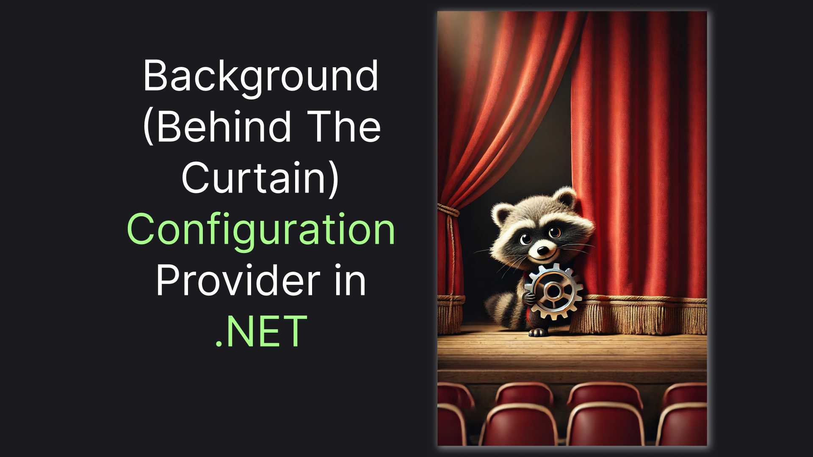
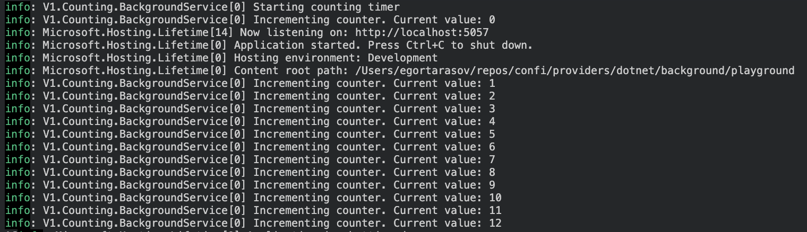

# Configuration Provider in .NET Based on Background Service

> Connecting ASP .NET Core Configuration System with Dependency Injection enabled `IHostedService`



.NET provides a versatile configuration framework, allowing us to [implement a custom configuration provider](https://medium.com/@vosarat1995/custom-configuration-provider-in-net-step-by-step-guide-3d8a3a8f7203). Most of the time, the provider's goal is to read configuration data from some source in the background. In the meantime, ASP .NET Core provides us with a simple way to enable a DI-based background process by injecting an `IHostedService` into our DI container. However, there is no built-in way to connect those two. Gladly, there is a (slightly tricky) way to do it - let me show you!

> Or jump straight to the [TLDR](#tldr) for spoilers 😉 

## Create a Bridge Between DI-Container and Configuration 

First thing first, let's create our project. We'll use the `web` template to have all the required dependencies, like `Microsoft.Extensions.Configuration` in place by default:

```sh
dotnet new web
```

Now, let's move to the most important question of this article: How do we connect data from objects inside a dependency injection container to the configuration system that does not have access to it? The answer is using the good old Singleton. 

Since we can only have one singleton in an application we can use the singleton as a data container to share the data between the DI-system and the rest of the app. Here's how we can implement it on a very basic level:

```csharp
public class ConfigurationStore
{
    public static ConfigurationStore Instance { get; } = new();
    private Dictionary<string, object> data = new();

    private ConfigurationStore(){}
}
```

We will also want the data "consumers" to know about the data changes as soon as they arrive, so let's spin up a little listening system:

```csharp
private List<Action<Dictionary<string, object>>> listeners = new();

public void AddListener(Action<Dictionary<string, object>> listener)
{
    listeners.Add(listener);
    listener(data);
}

public void NotifyListeners()
{
    foreach (var listener in listeners)
    {
        listener(data);
    }
}
```

Finally, let's implement methods for writing and reading the data. Of course, we'll also `NotifyListeners` whenever the data is being updated. Here's the code:

```csharp
public void SetValue(string key, object value)
{
    data[key] = value;
    NotifyListeners();
}

public void SetAll(IReadOnlyDictionary<string, object> newData)
{
    data = newData.ToDictionary(kvp => kvp.Key, kvp => kvp.Value);
    NotifyListeners();
}

public T GetValue<T>(string key) => (T)data[key];

public T? GetValueOrDefault<T>(string key) {
    if (data.TryGetValue(key, out object? value)) {
        return (T)value;
    }

    return default;
}
```

Now, with the bridge implemented let's first use it in a configuration provider!

## Implementing our Background Configuration Provider

I've described the process of making custom configuration providers in the dedicated [article](https://medium.com/p/3d8a3a8f7203). Basically, all we need to do is to call the `Load` method whenever we detect changes. Here our listening system comes in handy - we'll subscribe to the changes in the constructor and call the `Load` method from an update handler.

The `Load` method doesn't accept any parameters, so to access the updated data we would first need to capture it in a private field `_rawData`. Also, since in our case calling the `Load` method basically means that data has been changed we should also call `OnReload` at the end to notify the configuration system about the changes. Here's the complete code:

> The classes are expected to be nested inside the `ConfigurationStore` class, hence the short name. You can find the full class code at the end of the article.

```csharp
public class Source(ConfigurationStore store) : IConfigurationSource
{
    public IConfigurationProvider Build(IConfigurationBuilder builder) => new Provider(store);
}

public class Provider : ConfigurationProvider
{
    private Dictionary<string, object> _rawData = new();

    public Provider(ConfigurationStore store)
    {
        store.AddListener(data => {
            _rawData = data;
            Load();
        });
    }

    public override void Load()
    {
        Data = _rawData.ToDictionary(kvp => kvp.Key, kvp => kvp.Value?.ToString());
        OnReload();
    }
}
```

Now, you should be able to utilize the `ConfigurationStore` for updating the actual configuration. Let me show you how:

## Assembling a Working System

We'll do a very simple `IHostedService`, using our `ConfigurationStore` to update the `Counter` value. Here's what it might look like: 

```csharp
public class Counting
{
    public const string Key = "Counter";

    public class BackgroundService(ILogger<BackgroundService> logger, ConfigurationStore store) : IHostedService
    {
        public Task StartAsync(CancellationToken cancellationToken)
        {
            var currentValue = store.GetValueOrDefault<int>(Key);
            logger.LogInformation("Incrementing counter. Current value: {currentValue}", currentValue);
            store.SetValue(Key, currentValue + 1);

            return Task.CompletedTask;
        }

        public Task StopAsync(CancellationToken cancellationToken)
        {
            return Task.CompletedTask;
        }
    }
}
```

Of course, with the implementation, the incrementation will happen only once, which is not something we wish for. Instead, we should increment 

I have a [dedicated article](https://medium.com/p/d020c73b63a4) about implementing safe timer functionality. Long story short, we'll need the `Backi.Timers` nuget package:

```sh
dotnet add package Backi.Timers
```

Now, let's integrate the `SafeTimer` into our background service. Here's what our code should look like:

```csharp
using Backi.Timers;

public class Counting
{
    public const string Key = "Counter";

    public class BackgroundService(ILogger<BackgroundService> logger, ConfigurationStore store) : IHostedService
    {
        private SafeTimer _timer = null!;

        public Task StartAsync(CancellationToken cancellationToken)
        {
            logger.LogInformation("Starting counting timer");

            _timer = SafeTimer.RunNowAndPeriodically(
                TimeSpan.FromSeconds(1), 
                () => {
                    var currentValue = store.GetValueOrDefault<int>(Key);
                    logger.LogInformation("Incrementing counter. Current value: {currentValue}", currentValue);
                    store.SetValue(Key, currentValue + 1);
                },
                (ex) => logger.LogError(ex, "Error in counting timer")
            );

            return Task.CompletedTask;
        }

        public Task StopAsync(CancellationToken cancellationToken)
        {
            logger.LogInformation("Stopping counting timer");

            _timer.Stop();
            return Task.CompletedTask;
        }
    }
}
```

Finally, let's register all the things we've built app in this article. We'll need to add our configuration source, add our singleton to the DI container, and register our background service there as well:

```csharp
((IConfigurationBuilder)builder.Configuration).Add(new ConfigurationStore.Source(ConfigurationStore.Instance));

builder.Services.AddSingleton(ConfigurationStore.Instance);

builder.Services.AddHostedService<Counting.BackgroundService>();
```

Let's also slightly update logging to get a more compact view:

```csharp
builder.Logging.AddSimpleConsole(c => c.SingleLine = true);
```

Here's what we should get after starting our app via `dotnet run`



Let's also check that we will be able to get the configuration value from Microsoft's `IConfiguration` object. Let's first install a package, providing the `GetRequiredValue` extension method:

```sh
dotnet add package Confi
```

Next, we'll add an endpoint:

```csharp
using Confi;

// ...

app.MapGet("/counter", (IConfiguration config) => config.GetRequiredValue(Counting.Key));
```

Calling that endpoint via `curl localhost:5057/counter` we should get the current count, in my case, it was `16`. That wraps up our little journey, let's do a quick recap in the final section.

## TLDR;

We've found a way to connect `IHostedService` with the Configuration system using the good old Singleton. Here's a complete code of the underlying store, allowing passing configuration data between services:

```csharp
public class ConfigurationStore
{
    public static ConfigurationStore Instance { get; } = new();
    private Dictionary<string, object> data = new();

    private ConfigurationStore(){}

    private List<Action<Dictionary<string, object>>> listeners = new();

    public void AddListener(Action<Dictionary<string, object>> listener)
    {
        listeners.Add(listener);
        listener(data);
    }

    public void NotifyListeners()
    {
        foreach (var listener in listeners)
        {
            listener(data);
        }
    }

    public void SetValue(string key, object value)
    {
        data[key] = value;
        NotifyListeners();
    }

    public void SetAll(IReadOnlyDictionary<string, object> newData)
    {
        data = newData.ToDictionary(kvp => kvp.Key, kvp => kvp.Value);
        NotifyListeners();
    }

    public T GetValue<T>(string key) => (T)data[key];

    public T? GetValueOrDefault<T>(string key) {
        if (data.TryGetValue(key, out object? value)) {
            return (T)value;
        }

        return default;
    }
    
    public class Source(ConfigurationStore store) : IConfigurationSource
    {
        public IConfigurationProvider Build(IConfigurationBuilder builder) => new Provider(store);
    }

    public class Provider : ConfigurationProvider
    {
        private Dictionary<string, object> _rawData = new();

        public Provider(ConfigurationStore store)
        {
            store.AddListener(data => {
                _rawData = data;
                Load();
            });
        }

        public override void Load()
        {
            Data = _rawData.ToDictionary(kvp => kvp.Key, kvp => kvp.Value?.ToString());
            OnReload();
        }
    }
}
```

We've used the object in our `Counting.BackgroundService` to showcase the functionality. There are still some improvements to make, but I don't want to overflow this article, so maybe next time.

The source code for this article can be found [here on github](https://github.com/astorDev/confi/tree/main/providers/dotnet/background/playground). This article, as well as the underlying library, is part of the [project, called Confi](https://github.com/astorDev/confi) - don't hesitate to give it a star! ⭐

And also … claps are appreciated! 👏

